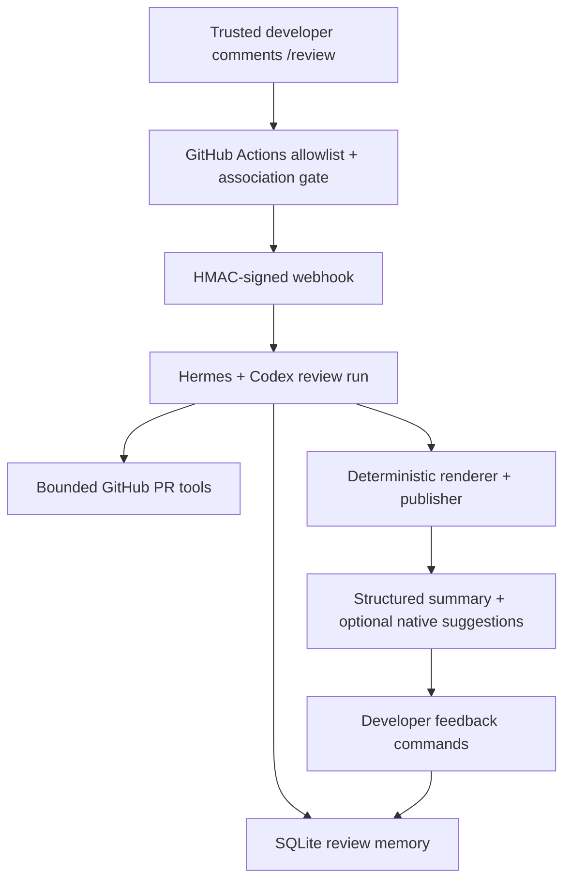

# Hermes GitHub PR review agent

This repository packages a locked-down Hermes + Codex reviewer for GitHub pull
requests. A trusted developer comments `/review`, GitHub Actions sends a signed
webhook, Hermes reviews the current PR snapshot through bounded read tools, and
the deterministic publisher posts a structured PR summary and, when safe, native
GitHub suggested changes.

The reusable part is the review engine: webhook routing, bounded GitHub reads,
SQLite finding memory, human feedback, deterministic publication, and operational
tooling. This repository currently ships the Eneo review profile. The profile is
where organization-specific policy lives: `bootstrap/SOUL.md`,
`bootstrap/workspace/AGENTS.md`, and `bootstrap/skills/eneo-pr-review/SKILL.md`.

Some runtime names still use the historical `ENEO_*` and `eneo_*` prefixes. Treat
those as compatibility names for this deployment, not as proof that the engine
can only review Eneo repositories.

## What It Does

- Reviews the exact base/head snapshot of an open GitHub PR.
- Reads PR metadata, diffs, and selected files through bounded plugin tools.
- Publishes every evidence-backed finding that survives the skeptical review
  gate; there is no fixed cap such as three findings.
- Re-checks previous unresolved findings on repeated reviews.
- Offers small local patch candidates that pass exact range and current-content
  checks through GitHub's native suggestion UI, grouped into one non-blocking
  review; coordinated changes stay in the copyable coding-agent brief.
- Stores findings, review runs, publication state, and human feedback in SQLite.
- Can show deterministic `/review ...` feedback commands so allowlisted
  developers can report false positives, scope confusion, and missed issues.
- Keeps comment delivery deterministic through `eneo_review_deliver`, not through
  free-form model output. Large reviews are split into deterministic comment
  parts instead of hiding findings.
- Can export a private shadow-mode verification bundle and store provider-neutral
  verifier/reconciliation state for a review run. The live deployment still
  publishes from Codex-owned findings unless an explicit reconciliation decision
  says otherwise.

## What It Is Not

- It is not a required merge gate by default. Treat early deployments as advisory
  calibration.
- It is not CodeQL, Dependabot, GitHub Dependency Review, or a CVE scanner. See
  [docs/SECURITY.md](docs/SECURITY.md) for the dependency-scanning boundary.
- It does not perform a complete CVE/GHSA scan of direct or transitive
  dependencies.
- It may comment on dependency risk when a PR changes dependency manifests or
  lockfiles, but deterministic dependency vulnerability scanning belongs in CI.
- It does not execute contributor code on the VPS.
- It does not give the model a shell, repository write tool, browser, delegation,
  or arbitrary GitHub write access.

## Review Flow



The model proposes and challenges findings. Plugin code owns the durable state,
publication, feedback parsing, snapshot checks, and GitHub writes.

Private verification and learning artifacts are outside this live path unless a
future runner explicitly wires them in. Verifier output is advisory evidence: it
does not publish comments, suppress findings, rewrite prompts, or gate pull
requests unless Codex records a reconciliation decision for the current run.

## Engine And Profile

| Area | Owner | Notes |
| --- | --- | --- |
| Webhook transport | `compose.yaml`, `examples/github/ai-review-request.yml` | Authenticates review and feedback requests before Hermes runs. |
| GitHub reads | `bootstrap/plugins/eneo_review_tools/` | Bounded PR metadata, diff, and file reads. |
| Review memory | `review_memory_data` SQLite volume | Findings, decisions, publications, feedback, coverage, run phases, and verifier reconciliation state. |
| Publication | `eneo_review_deliver` | Verifies snapshot and writes deterministic PR comments. |
| Reviewer identity | `bootstrap/SOUL.md` | Tone, evidence posture, and identity. |
| Review contract | `bootstrap/workspace/AGENTS.md` | Visible comment contract and evidence rules. |
| Review procedure | `bootstrap/skills/eneo-pr-review/SKILL.md` | Two-pass PR review procedure. |
| Example output | `examples/comments/example-review.md` | Single example of the rendered review shape. |
| Visible review copy | `bootstrap/plugins/eneo_review_tools/review_identity.py` | Centralized profile-facing title, continuation, fix-brief, and feedback messages. |

To adapt the reviewer for another team, start with the three profile files and
the GitHub workflow allowlist. Visible profile copy lives in
`review_identity.py`; keep the review title as a per-bundle constant because the
publisher parses it when splitting and superseding stored comments. Do not fork
the memory or publisher logic unless your runtime contract actually changes.

The long-term split is engine plus profile: the engine owns GitHub transport,
snapshot reads, memory, coverage, feedback, verifier reconciliation, and
publication; a profile owns project policy, skills, tone, and enabled verifier
providers. Today the shipped profile is Eneo, and the historical command/env
names remain for compatibility with the current deployment.

## Developer Workflow

Request a review with a new top-level PR comment:

```text
/review
```

After fixing findings, push a commit and request another review. A changed PR
snapshot creates a new review round. The previous round is kept as historical
context after the new one posts successfully.

When the summary reports optional suggestions, open **Files changed** to inspect
the patches in context. Apply one directly or add selected independent patches to
GitHub's suggestion batch. Use the coding-agent brief for coordinated work, run
CI after either path, and request a fresh `/review`. Applying a suggestion alone
does not resolve the finding.

Give feedback with a new top-level PR comment:

```text
/review false-positive F2 because <what code, guard, or invariant disproves it>
/review feedback scope F2 because <why this finding is in the diff but outside the intended PR scope>
/review feedback missed because <what concrete issue was missed and where>
```

`false-positive` is a finding decision. `feedback scope` and `feedback missed`
are review-quality signals; they do not suppress findings automatically.

## Operations

Use [docs/OPERATIONS.md](docs/OPERATIONS.md) for deployment, configuration,
GitHub token permissions, Dokploy setup, Codex login, runbook commands, backups,
updates, and private coach exports.

Common status commands in the `hermes-review` container:

```bash
eneo-review-memory runs --repo <org>/<repo> --limit 10
eneo-review-memory publications --repo <org>/<repo> --pr <number>
eneo-review-memory coverage --run-id <id> --json
eneo-review-memory verification-export --run-id <id> \
  --output /opt/data/review-memory/verification/run-<id>.json
```

## Security

Use [docs/SECURITY.md](docs/SECURITY.md) for the trust model, prompt-injection
posture, token boundaries, dependency-scanning scope, and data-handling notes.

The short version: the reviewer is useful because it has narrow tools and
durable audit state. Keep deterministic scanners, tests, type checks, migration
checks, and human ownership as separate controls.

## Validation

Run the bundle check before shipping changes:

```bash
./scripts/check_bundle.sh
```

The bundle validates Python imports, strict type checks, unit tests, replay
fixtures, and YAML. It cannot live-test your Dokploy routes, GitHub token
approval, ChatGPT OAuth state, or repository rules.
